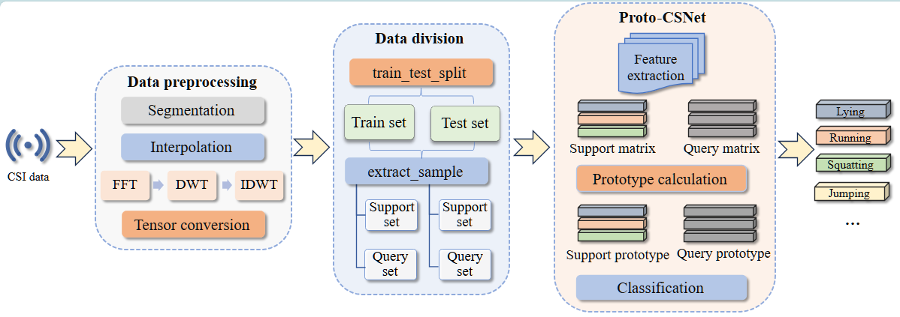

## 环境信息

```
GPU RTX 3090(24GB) * 1
python==3.7.16
pytorch=1.8.0
pip=22.3.1
```


## 代码使用

```python
# 安装依赖
conda env create -f environment.yml / 
pip install -r requirements.txt

# Proto-CSNet训练及推理方法
python mix_test.py


'''
部分对比方法
'''
# 孪生网络+CNN模型
python baseline.py

#孪生网络+ResNet12
python siam_resnet.py

# ProtoNet+CNN
python protonet_baseline.py

# ProtoNet+ResNet12
python protonet_resnet.py

```


## Proto-CSNet介绍

### 摘要：

随着5.5G时代的来临，通感一体化技术(Integrated sensing and communication, ISAC)在无线通信、智慧交通、智能家居等领域展现出其高精度感知功能。特别是在人体活动识别领域，研究者正探索利用WIFI信号中的信道状态信息（CSI）进行人体活动识别的可行性和便利性。然而，当前研究多依赖于复杂的网络模型来处理海量的CSI数据，以期构建高精度的检测模型。面对时间敏感的任务，研究面临着样本数量受限和对问题解决时效性要求严格的双重挑战。

为了解决上述问题，我们在本篇论文中提出了一种基于融合cnn和self-attention的原型网络模型，namely Proto-CSNet. 

首先，我们对数据进行时频变换和滤波处理，将数据从时域转换至频域，并除去样本中的异常值和噪声，以提高相似动作间识别的准确性。

然后，基于ACmix模型，我们在保留融合CNN的局部特征捕捉能力和Self-Attention的全局信息处理优势的同时，调整并构建了一个新的自定义的特征提取模块。

最后，我们将所构建的自定义模块与卷积神经网络相串联，并将其融合至元学习思想的原型网络中。

大量实验结果表明， Proto-CSNet优于现有研究算法，从而验证了其有效性。为验证本论文方法的有效性，我们收集了两个真实场景下的11种人体活动数据集进行大量的实验。实验结果显示，我们的方法在多个方面优于现有算法：（1）模型推理的精度超过了95%；（2）显著提高了模型训练和推理的速度。


### 模型结构：




## 论文地址：

[Proto-CSNet:](https://ieeexplore.ieee.org/stamp/stamp.jsp?tp=&arnumber=11036372)

```latex
@INPROCEEDINGS{11036372,
  author={Hu, Siyu and Liu, Jiqiang and Zhang, Chenxin and Zhu, Xiaoqiang and Li, Lingkun},
  booktitle={2024 20th International Conference on Mobility, Sensing and Networking (MSN)}, 
  title={Proto-CSNet: A Prototype Network Model Integrating CNN and Self-Attention for Enhanced Human Activity Recognition}, 
  year={2024},
  volume={},
  number={},
  pages={48-56},
  keywords={Wireless communication;Adaptation models;Accuracy;Prototypes;Feature extraction;Integrated sensing and communication;Data models;Human activity recognition;Wireless fidelity;Tuning;CSI;human activity recognition;self-attention;prototype network},
  doi={10.1109/MSN63567.2024.00018}}

```